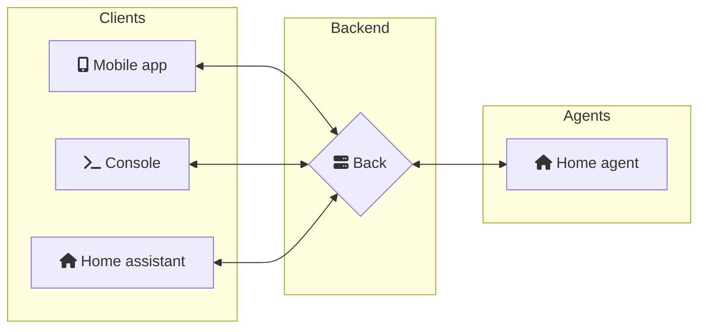

# KarAssistant

  
  
Kara is a personal assistant. Its purpose is to answer questions asked by a client.

## Structure

The project comprises 3 types of elements:

- Clients: these are the applications that will be used by users and interact with the back-end
- Back-end: this is the main service. It can receive, interpret and respond to customer queries. It can also use agents as data sources or to perform actions.
- Agent: Agents are physical components that enable sensors to take measurements or perform actions (coming soon).

## Available components

### Client: Flutter applications

### Back: Backend_node

This is the main service.
It can receive, interpret and respond queries from the clients.
Each query will be interpreted and compared with a skills database.
Example: for the sentence `what time is it ?` the skill used concerns the time. The back-end will respond with the time `It's 12:15`.

One of our objectives is to set up physical agents at home, for example. They could operate on raspberries and control certain objects such as lights or shutters.
