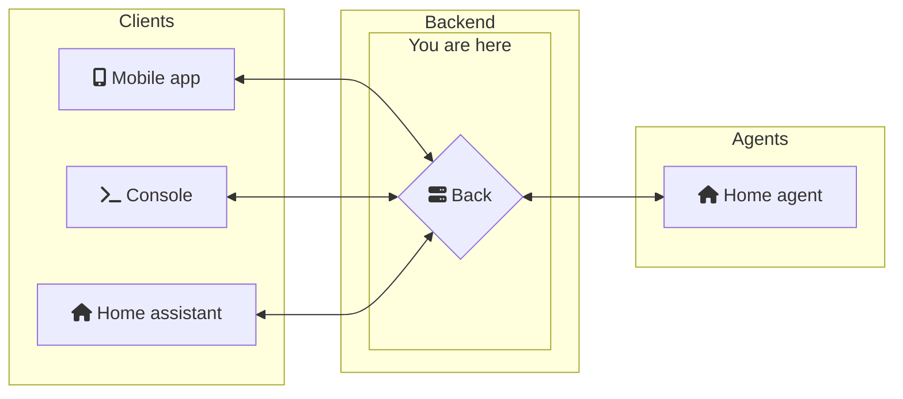
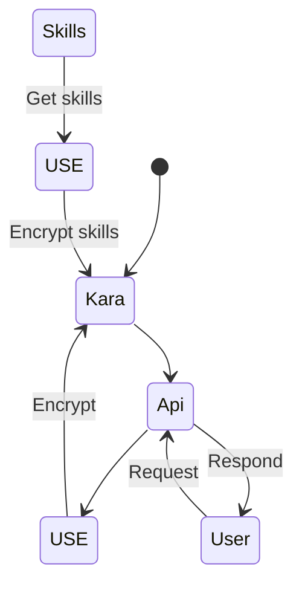

# Back-end node.js



This is the main service.
It can receive, interpret and respond queries from the clients.
Each query will be interpreted and compared with a skills database.
Example: for the sentence `what time is it ?` the skill used concerns the time. The back-end will respond with the time `It's 12:15`.

One of our objectives is to set up physical agents at home, for example. They could operate on raspberries and control certain objects such as lights or shutters.

## How it's work



USE = Universal Sentence Encoder

### You've missed the point ?

When the service starts up, skills will be in loaded. To do this, the `Universal Sentence Encoder` (USE) algorithm is used.
This will convert the samples sentences into vectors.
When a customer makes a request, the request phrase is embedded and compared with other vectors.
If the result of the comparison is close to 0, this means that the two sentences in question are similar and the skill code can be executed. The skill will then send the response sentence back to the client.

To see the skills [click here](back_node/skills)

## Install & start

### With node

Used version :

- Node.js: v18.13.0
- npm: 9.1.1

To install all packages

```
npm install
```

To run all packages

```
npm run start
```

### With docker-compose

Start

```
docker-compose up -d
```

Stop

```
docker-compose down
```
